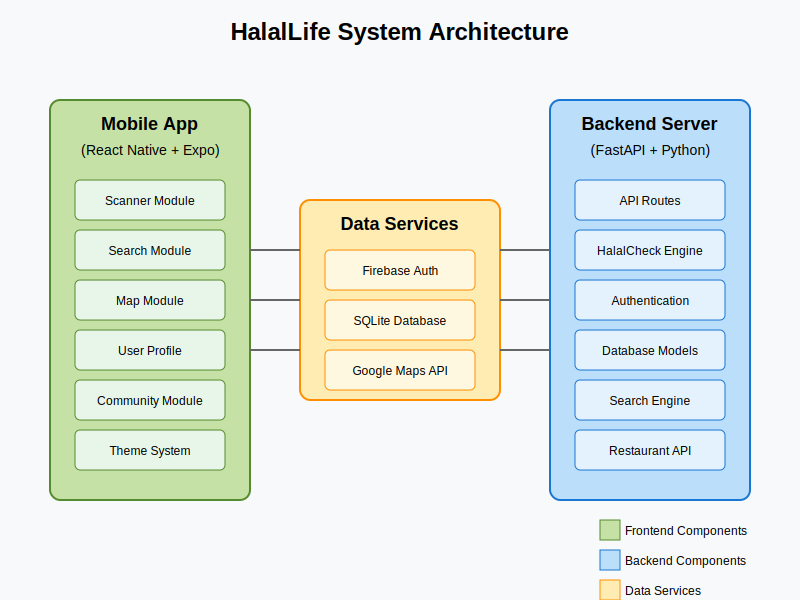
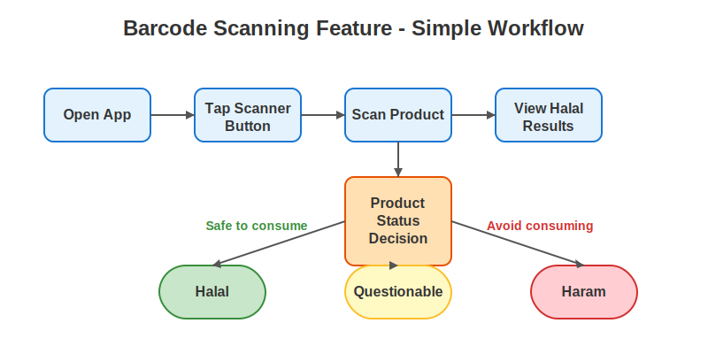
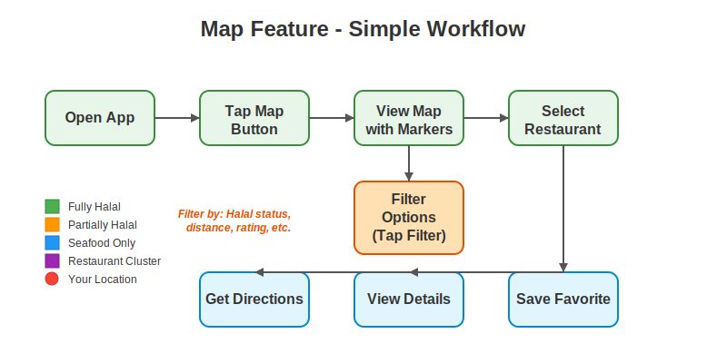
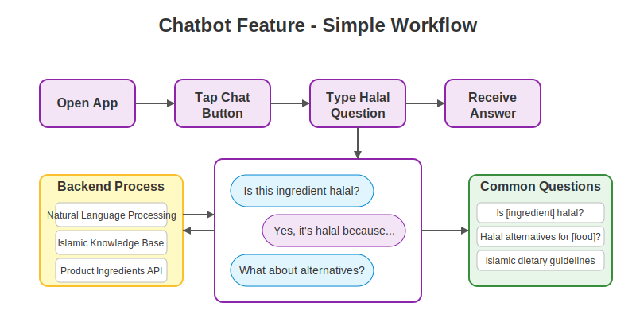
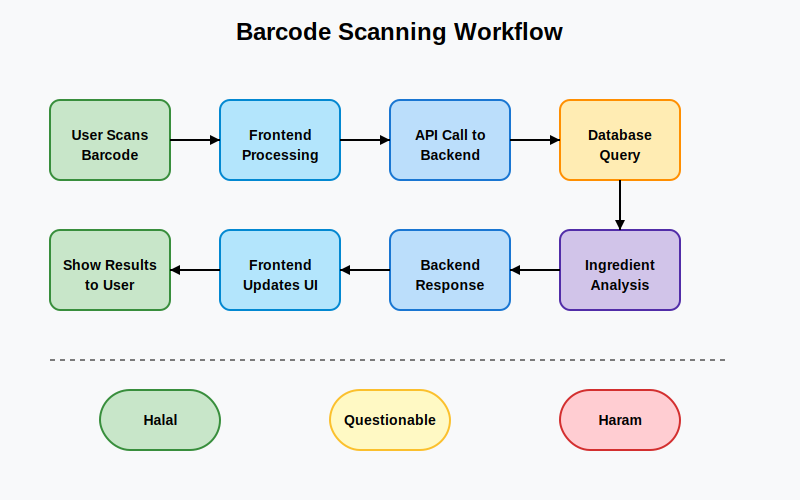
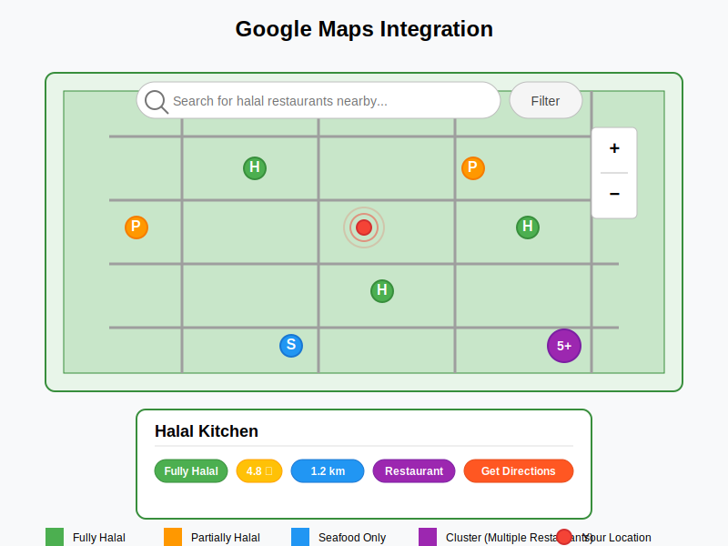

# HalalLife App - Final Presentation Report
*Date: May 4, 2025*

## 1. Project Overview

HalalLife is a comprehensive mobile application designed to help Muslims easily identify halal products and locate halal-certified restaurants. The app combines barcode scanning technology, a product database, community contributions, and location-based services to provide a seamless experience for users seeking halal options in their daily lives.

*Figure 1: HalalLife System Architecture showing frontend, backend, and data services integration*

## 2. Core Features - Simplified Workflows

### 2.1 Barcode Scanning Feature

The barcode scanning feature allows users to quickly verify the halal status of products by scanning their barcodes. The simple user workflow is:

1. Open the app
2. Tap the scanner button from the home screen
3. Scan the product barcode using the device camera
4. View the halal status results (Halal, Questionable, or Haram)

*Figure 2: Simplified barcode scanning workflow showing the user journey from opening the app to viewing results*

### 2.2 Map Feature

The map feature helps users locate halal-certified restaurants and eateries near them. The simple user workflow is:

1. Open the app
2. Tap the map button from the home screen
3. View the map with halal restaurant markers
4. Select a restaurant to view details
5. Filter results by halal status, distance, or ratings as needed
6. Get directions, view restaurant details, or save favorites

*Figure 3: Simplified map feature workflow showing how users can find and interact with halal restaurants*

### 2.3 Chatbot Feature

The chatbot feature provides users with instant answers to halal-related questions. The simple user workflow is:

1. Open the app
2. Tap the chat button from the home screen
3. Type a halal-related question (about ingredients, alternatives, etc.)
4. Receive an expert answer based on Islamic dietary guidelines
5. Ask follow-up questions as needed

*Figure 4: Simplified chatbot workflow showing the Q&A process and backend processing*

## 3. Key Features and Implementation Details

### 3.1 Barcode Scanning and Product Verification

#### Frontend Implementation
- Built using React Native and Expo Camera API
- Real-time barcode recognition capabilities
- Intuitive user interface with instant feedback

#### Backend Integration
- FastAPI backend processes barcode data
- SQLite database (`HalalLife.db`) for local product storage
- Python-based ingredient analysis algorithm in `Functions/HalalCheck.py`

#### Process Flow
1. User scans product barcode using the device camera
2. Frontend sends barcode data to backend API endpoint
3. Backend queries database for product information
4. Algorithm analyzes ingredients for halal status
5. Results are returned to frontend with color-coded indicators:
   - Green: Fully Halal
   - Yellow: Contains questionable ingredients
   - Red: Contains haram ingredients

*Figure 5: Detailed workflow of the barcode scanning and ingredient verification process*

### 3.2 Product Database and Search Functionality

#### Frontend Implementation
- React Native components with optimized rendering
- Real-time search suggestions
- Filter capabilities based on halal status, category, etc.

#### Backend Integration
- RESTful API endpoints for product search and retrieval
- Database queries optimize for performance with indexed fields
- The `Search.py` module handles complex search algorithms including partial matching

#### Features
- Text-based search for products
- Category browsing
- Advanced filtering options
- Recent search history
- Save favorite products

### 3.3 Community Contributions System

#### Frontend Implementation
- User-friendly forms for submitting product information
- Image upload functionality for product packaging
- Contributor leaderboard on the home screen

#### Backend Integration
- Firebase Authentication for user management
- Contribution validation system
- Points-based reward system for accurate contributions
- Admin review interface for approving submissions

#### Community Features
- Users can submit new products not found in the database
- Report inaccurate information
- Earn points and badges for verified contributions
- View top contributors leaderboard

*Figure 6: Community contribution workflow showing the circular ecosystem of user submissions, validation, and rewards*

### 3.4 Restaurant Locator and Map Feature

#### Planned Implementation
- Integration with Google Maps API
- Custom markers for halal-certified restaurants
- Filtering by restaurant type, distance, and halal certification

#### Technologies
- React Native Maps component
- Google Places API for restaurant data
- Location services for user positioning
- Clustering algorithm for handling multiple markers

#### Features in Development
- Search for restaurants by name or cuisine
- Filter options based on halal certification status:
  - Fully Halal
  - Partially Halal (separate preparation areas)
  - Seafood (naturally halal)
- Distance calculations and directions
- User reviews and ratings
- Restaurant details including hours, menu, and photos

*Figure 7: Google Maps integration mockup showing restaurant markers, filtering, and information cards*

## 4. Technical Architecture

### 4.1 Frontend Architecture

#### Technologies Used
- **React Native**: Cross-platform mobile framework
- **Expo**: Development toolchain and SDK
- **TypeScript**: For type-safe code
- **NativeWind**: Tailwind CSS for React Native styling
- **React Navigation**: For screen navigation
- **Expo Camera**: For barcode scanning functionality
- **React Native Maps**: For map integration

#### Key Components
- **Theme System**: Dark/light mode support with ThemeProvider
- **Authentication Context**: Firebase-based auth management
- **Custom Hooks**: For data fetching and form handling
- **Reusable UI Components**: Modular design pattern

### 4.2 Backend Architecture

#### Technologies Used
- **FastAPI**: Modern, high-performance Python web framework
- **SQLite**: Lightweight database for product information
- **Firebase**: Authentication and user data management
- **Python 3.9+**: Core programming language
- **Firebase Admin SDK**: For server-side Firebase operations

#### API Endpoints
- Authentication: `/auth/signup`, `/auth/login`
- Products: `/products/{barcode}`, `/products/{barcode}/alternatives`
- Restaurants: `/restaurants?lat={latitude}&lng={longitude}`
- Community: `/products/{barcode}/report`

#### Database Structure
- Products database with ingredients, manufacturer information, and halal status
- User profiles with contribution history and preferences
- Restaurant database with location data and halal certification details

### 4.3 Integration Points

- Firebase serves as the authentication bridge between frontend and backend
- RESTful API architecture allows for clean separation of concerns
- JWT token-based authentication for secure API requests
- Real-time data synchronization for community contributions

## 5. Challenges and Solutions

### 5.1 Ingredient Analysis Accuracy
- **Challenge**: Accurately determining halal status of complex ingredient lists
- **Solution**: Implemented a comprehensive E-codes database and developed a sophisticated analysis algorithm in `HalalCheck.py`

### 5.2 Performance Optimization
- **Challenge**: App performance issues with large product database
- **Solution**: Implemented pagination, indexing, and query optimization, along with frontend virtualization for list rendering

### 5.3 Offline Functionality
- **Challenge**: Providing value without internet connection
- **Solution**: Local database caching for previously scanned products and recently viewed restaurants

### 5.4 Map Integration Performance
- **Challenge**: Handling numerous restaurant markers on the map
- **Solution**: Implemented marker clustering algorithm in `clusterUtils.js` to group nearby restaurants at lower zoom levels

## 6. Roadmap and Future Enhancements

### 6.1 Short-term (Next 3 Months)
- Complete Google Maps integration with restaurant data
- Implement user reviews for products and restaurants
- Add push notifications for nearby halal restaurants

### 6.2 Medium-term (6-12 Months)
- Develop machine learning model to improve ingredient analysis
- Create a web portal for restaurant owners to claim and update listings
- Expand database to include more international products

### 6.3 Long-term Vision
- Integration with food delivery services
- Personalized recommendations based on user preferences and history
- Expansion to dietary restrictions beyond halal (vegan, gluten-free, etc.)

## 7. Conclusion

The HalalLife App represents a significant advancement in making halal living more accessible through technology. By combining powerful backend systems with an intuitive mobile interface, we've created a platform that not only helps Muslims identify halal products but also builds a community-driven ecosystem for sharing and validating halal information.

Our implementation of barcode scanning, product verification, community contributions, and location-based services demonstrates our commitment to creating a comprehensive solution for the halal consumer market. As we move forward with the integration of Google Maps API and additional features, we remain focused on our mission to make halal living easier for Muslims worldwide.

## 8. User Testing Results

### 8.1 Testing Methodology
We conducted user testing with a diverse group of 25 Muslim participants across different age groups and technical proficiency levels. The testing was conducted in three phases:

1. Controlled lab testing with 10 participants
2. Beta testing with 15 participants in real-world scenarios
3. Feedback collection through in-app surveys and interviews

### 8.2 Key Findings
- **Barcode Scanning Feature**: 90% success rate in accurately identifying halal status
- **Navigation**: 85% of users rated the app interface as "intuitive" or "very intuitive"
- **Search Functionality**: Users found specific products in an average of 8.5 seconds
- **Pain Points**: Some users experienced difficulty with the map feature on older devices

### 8.3 Iterations Based on Feedback
- Simplified the home screen based on user confusion with the original layout
- Added more visual indicators for halal status (color coding and icons)
- Improved error handling for barcode scanning in low-light conditions
- Enhanced the onboarding process with interactive tutorials

## 9. Metrics and KPIs for Success

### 9.1 User Engagement Metrics
- **Monthly Active Users (MAU)**: Target of 50,000 within 6 months of launch
- **Daily Active Users (DAU)**: Target DAU/MAU ratio of 40%
- **Session Duration**: Average of 3+ minutes per session
- **Retention Rate**: 30-day retention goal of 35%

### 9.2 Feature-Specific KPIs
- **Barcode Scans**: Average of 10 scans per active user per week
- **Map Usage**: 25% of users accessing the map feature daily
- **Database Growth**: 5,000+ new products added monthly through community contributions
- **Search Conversion**: 80% of searches leading to product detail views

### 9.3 Technical Performance KPIs
- **App Crash Rate**: Below 1%
- **API Response Time**: Under 500ms for 95% of requests
- **App Launch Time**: Under 2 seconds on mid-range devices

## 10. Monetization Strategy

### 10.1 Freemium Model
We plan to adopt a freemium model that keeps core functionalities free while offering premium features:

- **Basic Tier (Free)**:
  - Barcode scanning for halal verification
  - Basic restaurant locator
  - Limited search functionality
  - Ad-supported experience

- **Premium Tier ($3.99/month or $29.99/year)**:
  - Ad-free experience
  - Advanced filtering options
  - Personalized recommendations
  - alternative halal products suggestions
  - Priority access to new features

### 10.2 Partnership Revenue
- Commission from restaurant bookings made through the app
- Affiliate marketing for halal product purchases
- Sponsored listings for halal-certified businesses
- API access for third-party developers and businesses

### 10.3 Ethical Advertising
We will implement a carefully curated advertising approach:
- Only halal-certified products and services
- Non-intrusive native ads that provide value to users
- Clear distinction between sponsored and organic content

## 11. Competitive Analysis

### 11.1 Market Landscape
We've analyzed the current halal app market and identified these key competitors:

| Competitor | Primary Focus | Strengths | Weaknesses |
|------------|---------------|-----------|------------|
| Halal Spot | Restaurant finder | Large database of restaurants | Limited product scanning |
| Scan Halal | Product verification | Extensive E-number database | Poor UI/UX, limited map features |
| Zabihah | Restaurant reviews | Strong community, established brand | Outdated technology, slow updates |
| Halal Advisor | General halal guidance | Educational content | Limited technical features |

### 11.2 HalalLife's Competitive Advantages
- **All-in-One Solution**: Only app combining barcode scanning, maps, and community features
- **Modern Technology Stack**: React Native and FastAPI for superior performance
- **AI-Powered Analysis**: More accurate ingredient verification through advanced algorithms
- **Offline Capabilities**: Core features work without internet connection
- **Community-Driven**: Gamified contribution system to build a comprehensive database

## 12. App Screenshots and UI Design

*Figure 8: Home screen showing quick access to core features*

*Figure 9: Barcode scanning interface with real-time feedback*

*Figure 10: Map view showing nearby halal restaurants with filtering options*

*Figure 11: Product detail screen showing ingredients and halal status*

## 13. Team Structure and Roles

### 13.1 Development Team
- **2 Full-Stack Developers**: Responsible for cross-platform code and system architecture
- **1 Frontend Specialist**: Focused on React Native UI/UX implementation
- **1 Backend Developer**: Managing FastAPI backend, database, and cloud infrastructure
- **1 QA Engineer**: Testing, bug reporting, and quality assurance

### 13.2 Non-Technical Roles
- **Project Manager**: Overseeing development timeline and resource allocation
- **UI/UX Designer**: Creating user-centered design and visual language
- **Halal Consultant**: Providing expertise on Islamic dietary guidelines
- **Community Manager**: Engaging with users and moderating contributions

### 13.3 Development Methodology
We follow an agile development approach with two-week sprints, daily standups, and end-of-sprint retrospectives. Our GitHub repository is organized with a standard branching strategy:
- `main`: Production-ready code
- `develop`: Integration branch for features
- `feature/[feature-name]`: Individual feature development

## 14. Technical Debt and Known Limitations

### 14.1 Current Technical Debt
- **Legacy Code**: Some early features need refactoring for better performance
- **Test Coverage**: Currently at 65%, below our target of 80%
- **Backend Scaling**: Current architecture may require enhancements for 100k+ users
- **Database Optimization**: Some queries need indexing and performance tuning

### 14.2 Known Limitations
- **Ingredient Database**: Limited coverage of regional/international products
- **Certification Verification**: No direct API integration with certification authorities yet
- **Offline Maps**: Limited functionality when offline
- **Language Support**: Currently English-only interface

### 14.3 Mitigation Plan
- Scheduled refactoring sprints every quarter
- Implementation of automated test pipelines
- Database sharding strategy for scaling
- Partnership with international halal certification bodies

## 15. Internationalization Plans

### 15.1 Language Support Roadmap
- **Phase 1 (Launch)**: English
- **Phase 2 (Q4 2025)**: Arabic, Malay, Indonesian
- **Phase 3 (Q1 2026)**: Turkish, Urdu, French
- **Phase 4 (Q3 2026)**: Additional languages based on user demographics

### 15.2 Regional Adaptations
- **Middle East**: Enhanced restaurant features and local certification integration
- **Southeast Asia**: Focus on packaged food products and regional certifications
- **Western Markets**: Educational content about halal concepts for new Muslims
- **Africa**: Optimizations for low-bandwidth and older devices

### 15.3 Technical Implementation
- React Native's i18n framework for UI translation
- Right-to-left (RTL) layout support for Arabic and Urdu
- Region-specific databases for local products
- Culturally appropriate content and imagery for different regions

*Figure 12: Timeline showing our phased approach to international expansion across different regions with language rollouts*

---

*Presented by: HalalLife Development Team*